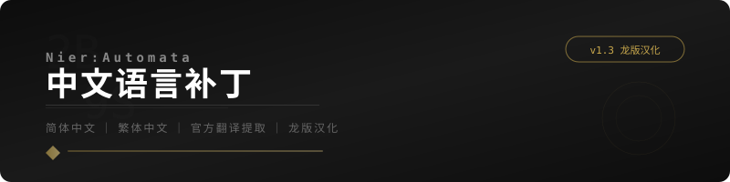

  

  
  
  
  
  
  

  <a href="https://gitee.com/WLongWLong/nier_chinese">📦 Gitee 原项目</a>
  &nbsp;&middot;&nbsp;
  <a href="#安装汉化补丁">📖 安装教程</a>
  &nbsp;&middot;&nbsp;
  <a href="#下载链接">⬇️ 下载补丁</a>
  &nbsp;&middot;&nbsp;
  <a href="#联系和反馈">💬 联系作者</a>

---

> 📦 **GitHub 镜像** — 本仓库同步自 [Gitee: WLongWLong/nier_chinese](https://gitee.com/WLongWLong/nier_chinese)  
> 原作者: **WLongWLong** | 仅供 GitHub 用户方便访问，原项目以 Gitee 为准

## 📖 项目介绍

通过提取 **Switch 版《NieR:Automata》的官方简体中文和繁体中文**制作的全新汉化补丁。

- ✅ 完整翻译 **DLC 剧情任务** 及 DLC 附带物品
- ✅ 采用 **官方翻译**，角色名称、物品名称标准化
- ✅ 相比第三方翻译更贴合原著，方便查找攻略资料
- ✅ 纯个人作品，**完全免费**，无广告无恶意代码

> 💡 **龙版汉化的优势**：基于官方 Switch 版翻译，质量最高，更新最活跃

## 📸 截图预览

  <a href="screenshots.md">👉 查看完整汉化效果截图（14张）</a>

  
  
  
  

  <a href="screenshots.md">📷 更多游戏内截图 →</a>

## ⬇️ 下载链接

| 网盘 | 链接 | 提取码 | 说明 |
|------|------|--------|------|
| ☁️ **123云盘** | [点击下载](https://www.123865.com/s/Ux9Fjv-3IgZh?pwd=kZiL#) | `kZiL` | 速度较快，需注册转存 |
| ☁️ **百度网盘** | [点击下载](https://pan.baidu.com/s/1Rkp3olc36IutmCstug2SLg?pwd=n8vp) | `n8vp` | 经典网盘，速度较慢 |
| 💬 **QQ群文件** | 加入下方 QQ群 | — | 免费进群获取 |

> **当前版本：1.3** | 后续更新和 BUG 修复在本仓库和 [B站](https://space.bilibili.com/316424202) 发布

## 📦 版本选择

龙版汉化分为两个版本，**二选一下载即可**：

| 版本 | 特点 | 适合人群 |
|------|------|----------|
| 🎯 **基础版** | 一比一移植官方翻译，与 NS 掌机内容相同 | 喜欢原汁原味的玩家 |
| 🚀 **增强版** | 重制字体贴图，**兼容 4K 分辨率**，修复官方错别字，补充未翻译部分，汉化主界面菜单 | 追求最佳体验的玩家 |

> **兼容性：** Steam 版 · 微软商店版 · SteamDeck 掌机版，安装方法均相同

### 文件校验

| 文件 | MD5 | SHA-256 |
|------|-----|---------|
| `龙版汉化基础版.zip` | `F5E59E78E0881C207CB453BFB2383CFE` | `BFB0908DA7D893463B645744CB708C6762ED69AC28A8708B1060BC76A50542A6` |
| `龙版汉增强版.zip` | `339D492E7CF3F2C6BD5F2723F4DF09A0` | `6FBD6323E769C39D97B9A1192B55423BEB3AECBDBAD19C1EE61CBA1D4836468C` |

## 📥 安装汉化补丁

> ⚠️ **如果你已安装旧版龙版汉化**：先打开 LangTools 工具移除汉化，再到开始菜单卸载 LangTools 并清除配置文件。  
> 如果 LangTools 无法启动：手动删除 `data` 目录下所有文件夹和 `data201.cpk`，然后用 Steam 验证游戏文件完整性。

### 安装步骤

#### 1️⃣ 准备干净的游戏文件
确保游戏**没有装过任何自定义模组和其他汉化程序**。

> ⚠️ **不要使用俄语第三方修改版游戏文件及其衍生版本**，俄语与中文存在文件冲突。  
> 参考：[简化版文件列表](other/filelist.txt) | [文件列表截图](other/filelist.png) | [完整版文件列表](other/filelistall.txt)

#### 2️⃣ 下载汉化包
从[上方链接](#下载链接)下载最新汉化包，**确保后缀名为 `.zip`**。

#### 3️⃣ 解压汉化包
将 `龙版汉化XX版.zip` 解压到任意位置。如果系统自带解压报错，可尝试 [7zip](https://www.7-zip.org/download.html)、[WinRAR](https://www.rarlab.com/download.htm) 等软件。

#### 4️⃣ 找到游戏安装目录

| 平台 | 路径 |
|------|------|
| **Steam 版** | 库 → NieR:Automata → 右键 → 管理 → 浏览本地文件 |
| **Xbox 版** | 安装目录下的 `data` 文件夹 |

  
  

#### 5️⃣ 备份原文件
将游戏目录 `data` 文件夹中的 **`data100.cpk`** 备份或重命名，以便后续还原。

#### 6️⃣ 复制补丁文件
将解压得到的 **`data100.cpk`** 和 **`data201.cpk`** 两个文件移动到游戏的 `data` 文件夹中。

#### 7️⃣ 设置 Steam 语言
在 Steam 库中右键 NieR:Automata → 属性 → 通用，将语言改为：

| 目标语言 | Steam 语言设置 |
|----------|---------------|
| **简体中文** | **德语** |
| **繁体中文** | **西班牙语** |

  
  

#### 8️⃣ 游戏内切换语言
启动游戏，在选项中将语言调为 **简体中文** 或 **繁体中文**。

#### 9️⃣ 🎉 完成！
恭喜，你已经可以享受中文版本的 NieR:Automata 了！

### 移除汉化补丁

1. 打开游戏安装目录
2. 删除 `data` 文件夹中的 `data100.cpk` 和 `data201.cpk`
3. 将备份的 `data100.cpk` 还原到 `data` 文件夹中

### 补丁安装出错处理

| 问题 | 解决方案 |
|------|----------|
| **压缩包损坏** | 重新下载补丁文件 |
| **游戏文件被修改** | Steam 验证游戏文件完整性 |
| **其他问题** | 加 QQ 群询问（见下方） |

> Steam 验证完整性：库 → NieR:Automata → 右键 → 属性 → 已安装文件 → 验证游戏文件的完整性

  
  

## 📊 与其他汉化补丁对比

| 汉化版本 | DLC汉化 | 翻译来源 | 简体中文 | 繁体中文 | 日文支持 | 英文支持 | 更新状态 |
|----------|---------|----------|:--------:|:--------:|:--------:|:--------:|:--------:|
| **🐉 甲辰龙年版** | ✅ 支持 | **官方翻译** | ✅ | ✅ | ✅ | ✅ | 🟢 **长期更新** |
| 天邈汉化 1.4 | ✅ 支持 | 非官方翻译 | ✅ | ❌ | ❌ | ✅ | 🔴 不再更新 |
| 轩辕汉化 6.5 | ✅ 支持 | 非官方翻译 | ✅ | ❌ | ✅ | ❌ | 🔴 不再更新 |
| PS版提取 1.1 | ✅ 支持 | 官方翻译 | ❌ | ✅ | ✅ | ❌ | 🔴 不再更新 |

## 🎮 Mod 支持

原则上只要 Mod 跟汉化文件没有冲突，影响不大。建议**先安装汉化补丁，再安装 Mod**。

> 画质和性能已经比刚发布时好太多，不建议额外折腾 Mod。

## 🪟 微软商店版说明

本汉化基于 **Steam 版**制作，微软商店版因文件结构相似可直接使用。但相似不等于相同，兼容性有待测试。

## ⚠️ 已知问题

### 游乐园 Boss 名字差异
游乐园 Boss 在日文中显示「ボーヴォワール」（波娃），英文中显示「Simone」（西蒙）。这是官方设置的不同词条调用，不是汉化 BUG，暂不修改。

### 版本限制
本补丁基于 **21 版游戏文件**制作，目前**不支持 17 版**游戏。

## 💬 联系和反馈

| 渠道 | 说明 |
|------|------|
| 💬 **QQ群①** | 162212815（已满） |
| 💬 **QQ群②** | 163614804（已满） |
| 💬 **QQ群③** | 163617787 |
| 📺 **B站** | [@316424202](https://space.bilibili.com/316424202) |
| 📦 **Gitee** | [WLongWLong/nier_chinese](https://gitee.com/WLongWLong/nier_chinese) |

> 🙏 只想拿资源不聊天的朋友请主动退群，给新人留出位置。

## ☕ 支持开发者

本工具**完全免费**，无广告无恶意代码。作者利用业余时间开发维护，如果你觉得好用，可以请作者喝杯咖啡 ❤️

  
  

> ⚠️ **务必备注「尼尔汉化」**，否则难以区分捐助来源  
> 妥善保存订单号，后期可能为捐助用户提供专属功能

  

  <a href="donate.md">🏆 查看令人引以为傲的捐赠者名单 →</a>

---

  Made with ❤️ by <strong>WLongWLong</strong> · 同步至 GitHub 方便海外用户访问

