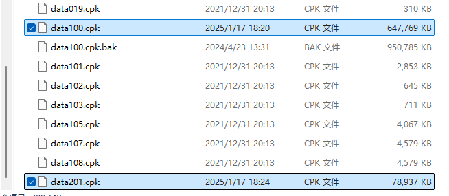

# NieR_Chinese

#### 介绍

[龙版汉化项目主页](https://gitee.com/WLongWLong/nier_chinese)

通过提取 Switch 版 NieR:Automata 的官方简体中文和繁体中文制作。  
目前游戏界面和物品翻译基本与 Switch 没有区别，并且完整翻译 DLC 剧情任务，以及 DLC 附带物品。  
龙版汉化的优势在于，采用官方翻译，相比其他第三方翻译更加贴合原著。角色名称、物品名称等更加标准化，随着时间的推移更多人会倾向于官方设定的名称，方便查找资料攻略等。

纯个人作品，没有团队，本工具完全免费，现在和以后都不会加入任何广告和恶意代码。  
因游戏内容巨大，难免存在测试不周的情况。若你遇到汉化导致的错误，请从各种渠道向我提交反馈，以便及时修复问题。

#### 截图

[截图预览](screenshots.md)

#### 下载链接

[123云盘（提取码: kZiL）](https://www.123865.com/s/Ux9Fjv-3IgZh?pwd=kZiL#)
[百度云盘（提取码: n8vp）](https://pan.baidu.com/s/1Rkp3olc36IutmCstug2SLg?pwd=n8vp)

123云盘相比百度云盘的速度会快一点，但是需要注册账号把文件转存到自己账号里才能免费下载。  
建议通过本文“[联系和反馈](#联系和反馈)”章节，免费进群后，从群文件中获取所需资源。

> 当前汉化补丁版本号：1.3  
> 提示：后续更新提醒和 BUG 修复，只在本仓库和 B 站发布动态。  
> 欢迎关注我的 [B 站账号](https://space.bilibili.com/316424202)

龙版汉化分为 **基础版** 和 **增强版** 两个版本，根据自己的喜好 **二选一下载** 即可。

 **基础版：** 
一比一移植的官方翻译，不做任何修改，争取与 NS 掌机的内容相同。官方翻译存在错别字或者汉化不全的问题，4K 分辨率下可能存在字体模糊的情况，适合喜欢原汁原味的玩家。

 **增强版：** 
重制所有字体贴图，使之兼容 4K 分辨率。修复官方汉化中出现的错别字，补充官方汉化未翻译的部分，汉化游戏主界面的菜单为中文。

此汉化包兼容 Steam 版，微软商店版，以及 SteamDeck 掌机版，安装方法均相同。

> File: 龙版汉化基础版.zip  
> MD5: F5E59E78E0881C207CB453BFB2383CFE  
> SHA-256: BFB0908DA7D893463B645744CB708C6762ED69AC28A8708B1060BC76A50542A6

> File: 龙版汉增强版.zip  
> MD5: 339D492E7CF3F2C6BD5F2723F4DF09A0  
> SHA-256: 6FBD6323E769C39D97B9A1192B55423BEB3AECBDBAD19C1EE61CBA1D4836468C

#### 安装汉化补丁

> **注意：**  
> 如果你已经安装旧的龙版汉化，请打开 LangTools 工具，将汉化补丁移除，然后在开始菜单中将 LangToos 工具从计算机中卸载，并同时选择清除配置文件。现在新的汉化补丁已经用不到 LangToos 程序。  
> 如果你的 LangTools 工具出现问题，无法正常启动。请尝试手动删除游戏目录中 data 文件夹里的所有文件夹和“data201.cpk”文件后，再使用 Steam 验证游戏文件的完整性功能修复游戏文件。

1.  **首先要拥有一份干净的游戏文件**，即没有装过任何自定义模组和其他汉化程序的游戏文件。除非你完全确定自己的模组文件不会影响汉化。

> **不要使用某俄语的第三方修改版游戏文件，以及其衍生版本**。俄语与中文存在文件冲突。  
> 干净的游戏文件列表，可以参考[简化版文件列表](other/filelist.txt)或[文件列表截图](other/filelist.png)，以及[完整版文件列表](other/filelistall.txt)。

2. 通过本页面[上方链接](#下载链接)下载最新汉化包。 **确保下载的文件后缀名是“.zip”结尾，否则自行检查汉化包是否下载成功。** 

3. 将下载得到的“龙版汉化XX版.zip”文件解压到任意自己能找到的位置。如果使用系统自带的解压功能报错，可以尝试更换其他压缩解压软件如 [7zip](https://www.7-zip.org/download.html)、[WinRAR](https://www.rarlab.com/download.htm)、[Bandizip](https://www.bandisoft.com/bandizip/)、360压缩、2345好压等软件。

4. 找到游戏的安装目录并打开。

> Steam 版：  
> 

> Xbox 版：  
> 

5. 将游戏目录中 data 文件夹里的“data100.cpk”文件备份或者重命名，以便后续进行还原。

6. 将“data100.cpk”和“data201.cpk”两个文件，移动到游戏的 data 文件夹中。

7. 打开 Steam，进入库的 NieR:Automata 页面。点击右边齿轮，选择“属性。”  
在“通用”选项卡中，将语言改成“德语”后，游戏即可显示简体中文。如果需要繁体中文，请将语言改成“西班牙语”。（此步骤只影响游戏启动时的第一次 Loading 动画的显示语言，对游戏本身的显示语言并无影响）

8. 启动游戏，打开游戏选项，将语言调成“简体中文”或“繁体中文”即可。

9. 恭喜，你已经可以享受中文版本的 NieR:Automata 了。

#### 移除汉化补丁

1.打开游戏的安装目录。

2.删除游戏目录中 data 文件夹里的“data100.cpk”和“data201.cpk”两个文件。

3.将安装时备份的“data100.cpk”文件还原到 data 文件夹里。

#### 关于补丁安装出错的处理方案

> 遇到问题应该先自行尝试解决，研究一番实在无果的时候再去考虑请教别人。  
> 如需求助，请详细描述自己遇到的问题，并提供截图、问题发生的步骤等。  

首先要保证从网盘下载的补丁文件没有发生损坏，几率很小但有可能会发生下载文件不完整的情况，最常见的就是解压压缩包的时候，系统提示无法解压或文件损坏，这种只要重新下载补丁文件来解决。

其次要保证游戏文件的完整性和正确性，更多的时候，汉化补丁没有安装成功都是因为游戏文件发生了变更（比如安装了其他汉化补丁或者模组）。需要提前将游戏文件恢复成原样，可以在 Steam 左边游戏列表里找到“NieR:Automata™”，在“NieR:Automata™”上点击右键，在弹出的菜单里点击“属性”。在属性窗口左边点击“已安装文件”菜单，在右边点击“验证游戏文件的完整性”按钮。完整性验证完成后，重新安装补丁即可。

其他无法解决的问题，请加 QQ 群询问。

#### 与其他汉化补丁的比较

|				|DLC汉化	|官方翻译	|简体中文支持	|繁体中文支持	|日文支持	|英文支持	|更新状态	|
|---|---|---|---|---|---|---|---|
|天邈汉化1.4		|支持	|非官方翻译	|支持			|不支持			|不支持		|支持		|不再更新	|
|轩辕汉化6.5		|支持	|非官方翻译	|支持			|不支持			|支持		|不支持		|不再更新	|
|PS版提取1.1		|支持	|官方翻译	|不支持			|支持			|支持		|不支持		|不再更新	|
|甲辰龙年版汉化	|支持	|官方翻译	|支持			|支持			|支持		|支持		|长期更新中	|

还有其他略冷门的汉化补丁，比如游侠汉化，多合一汉化等，因为我使用较少，暂不参与比较。

#### 关于 Mod 支持

原则上只要 Mod 文件跟汉化文件没有冲突，基本不会有太大影响。但鉴于 Mod 的安装方式多种多样，实在难以保证兼容性。就目前的游戏状态来说，画质和性能已经比刚发布好太多，并不建议额外折腾 Mod。如果实在需要 Mod 请先安装汉化补丁后再安装 Mod。

#### 关于 微软商店的尼尔机械纪元成神版

由于本汉化程序现阶段基于 Steam 平台的优尔哈版制作，而微软版与 Steam 版游戏文件基本相似，所以直接安装可以使用。但相似不等于相同，至于会不会出现兼容性问题，还有待大家测试。

#### 已知问题

关于游乐园 Boss 的名字与 Switch 版游戏显示不相同的问题，这其实并不是汉化导致的 BUG。因为官方为她设置了两个不同名字的词条，在不同的语言中会分别调用各自的词条。比如日文中显示的是“ボーヴォワール”，翻译成中文意思大概是“波娃”，而英文中显示的是“Simone”，翻译成中文也就是“西蒙”。虽然可以强制将文本改过来，但这会导致中文翻译与对应词条的意思不相同，这很不优雅甚至会导致新的 BUG，所以这个版本暂时不打算做任何修改。

本补丁基于 21 版游戏文件提取制作，因此目前不支持 17 版游戏，等以后有时间会添加 17 版的支持。

#### 联系和反馈

QQ群：

尼尔汉化模组交流群①：162212815（已满）

尼尔汉化模组交流群②：163614804（已满）

尼尔汉化模组交流群③：163617787

不情之请：因为群聊人数日益爆满，还麻烦只想拿资源不打算聊天的朋友主动退下群，以便给后来的新人留出位置。当然想聊天和寻求帮助的可以留下来，群聊进出不会添加任何限制。

#### 支持开发者

本工具是完全免费的，现在和以后都不会加入任何广告和恶意代码。作者平时上班比较忙，为了开发了这个工具付出了很多宝贵的业余时间。如果你有心想支持鼓励作者继续开发维护的话，可以请作者喝杯咖啡，或者与作者分享你喜欢的零食。 :yum: 

>  :loudspeaker:  :loudspeaker:  :loudspeaker:   
> **请务必备注您来自“尼尔汉化”之类的关键词**，不然我难以区分您的捐助来自哪个项目。  
> 如果发现名单中没有您的名字，或者名字有误，联系我后，可以通过提供订单号来修改。  
> **请妥善保存您的订单号，后期可能会为已捐助用户提供专属功能（专属名称、外观等）。**

#### 捐赠者名单

 :point_down:  :point_down:  :point_down:  :point_down:  :point_down:  :point_down:  :point_down:  :point_down:  :point_down:  :point_down:  :point_down:  :point_down:  :point_down:  :point_down:  :point_down:  
 :point_right:  :point_right: [查看令人引以为傲的捐赠者名单](donate.md) :point_left:  :point_left:  
 :point_right:  :point_right: [查看令人引以为傲的捐赠者名单](donate.md) :point_left:  :point_left:  
 :point_right:  :point_right: [查看令人引以为傲的捐赠者名单](donate.md) :point_left:  :point_left:  
 :point_up_2:  :point_up_2:  :point_up_2:  :point_up_2:  :point_up_2:  :point_up_2:  :point_up_2:  :point_up_2:  :point_up_2:  :point_down:  :point_down:  :point_down:  :point_down:  :point_down:  :point_down:  

