# NieR_Chinese

#### 介绍

此全新自制补丁，通过提取 Switch 版 NieR:Automata 的官方简体中文和繁体中文制作。  
目前游戏界面和物品翻译基本与 Switch 没有区别，并且完整翻译 DLC 剧情任务，以及 DLC 附带物品。  
鉴于 Switch 版官方汉化本身就不完全，后期主要对官方没有汉化的部分进行补充完善。

#### 截图

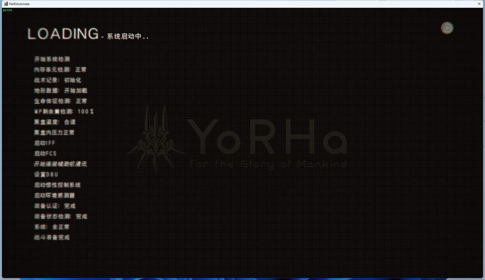

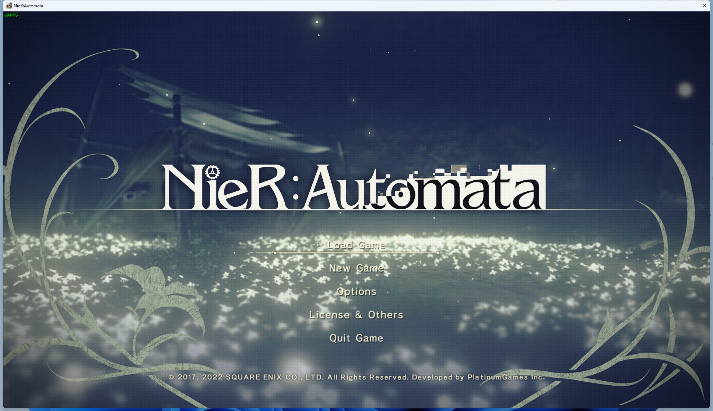

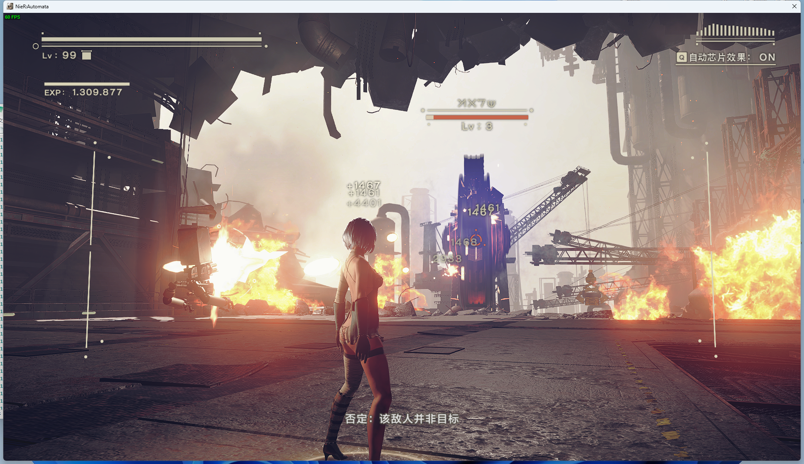

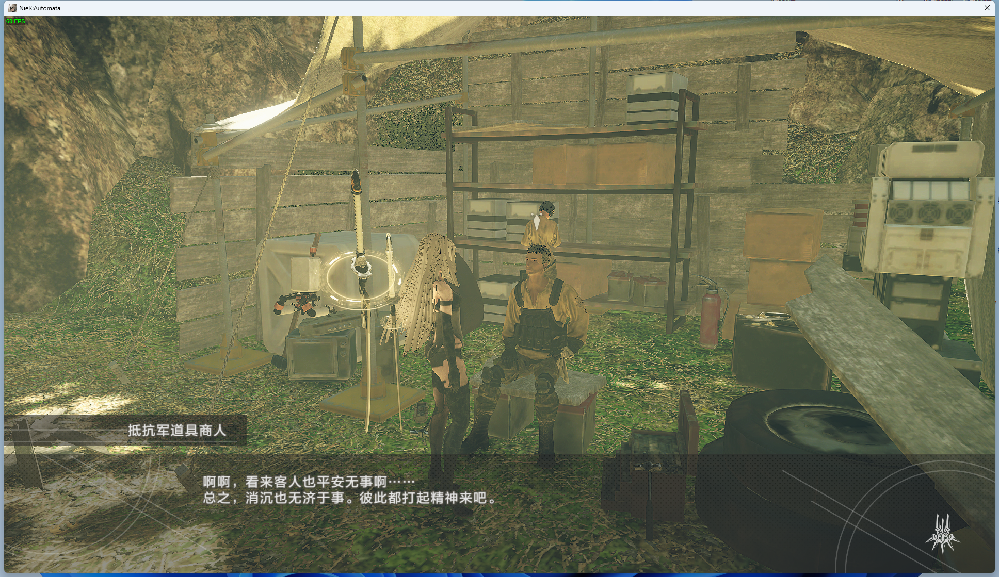

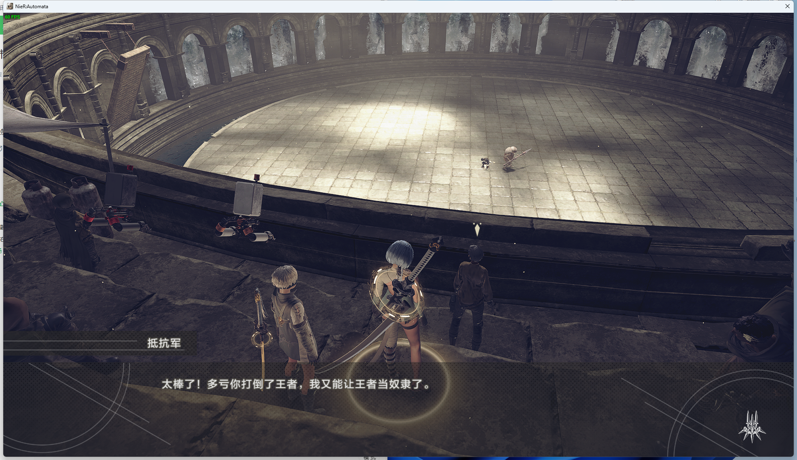

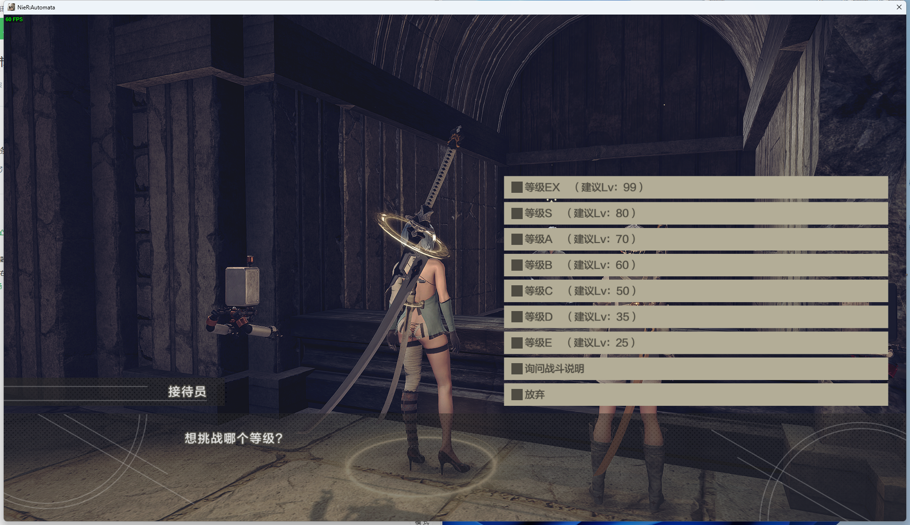

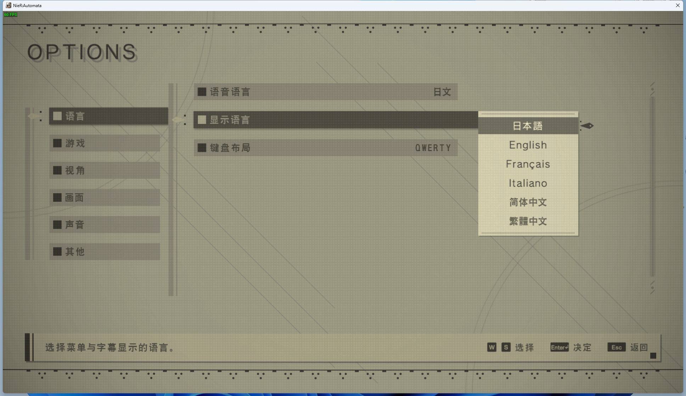

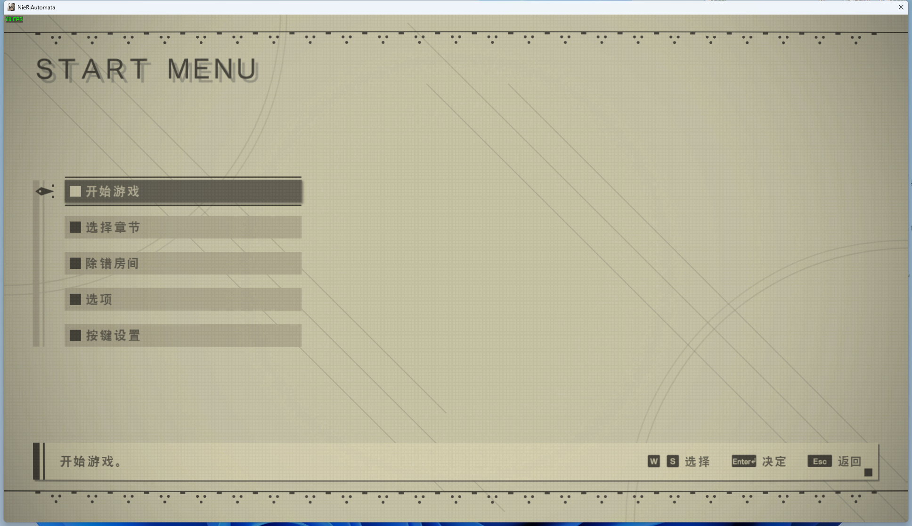

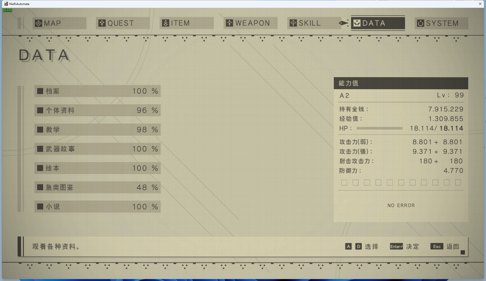

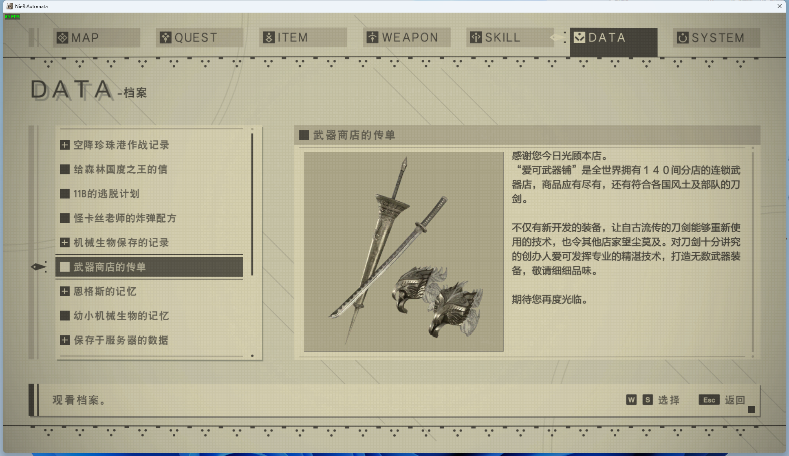

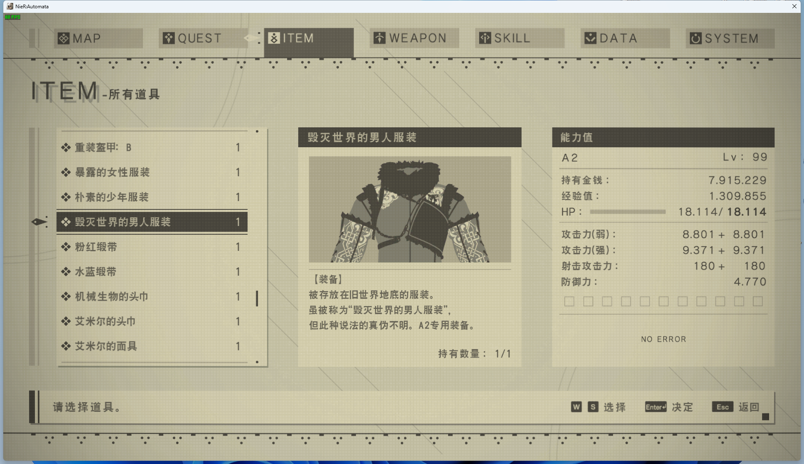

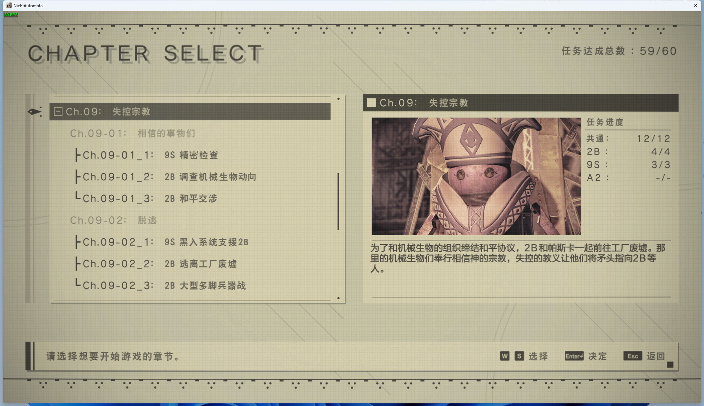

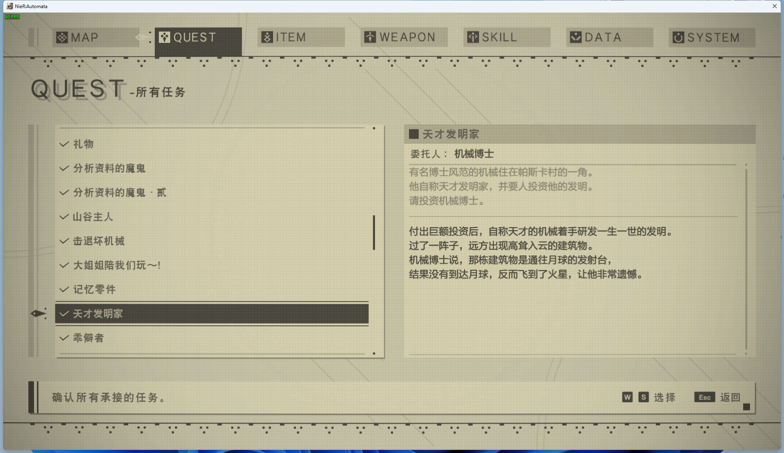

#### 下载链接

> 补丁当前最新版本号：0.0.1  
> 提示：只要版本号相同就无需更新，后续更新提醒只在本仓库和 B 站发布。
> 欢迎关注我的 [B 站账号](https://space.bilibili.com/316424202)

[百度云盘（提取码: n8vp）](https://pan.baidu.com/s/1Rkp3olc36IutmCstug2SLg?pwd=n8vp)
[夸克网盘（提取码: LA2T）](https://pan.quark.cn/s/24d581a9aca4)
[123云盘（提取码: kZiL）](https://www.123pan.com/s/Ux9Fjv-3IgZh.html)

> 防止下载过程中出现文件损坏，请下载后检验文件哈希  
> File: NieR_Chinese.zip  
> CRC32: FCA4ABA5  
> MD5: 5229E051619E7431E55790E330E41ACA  
> SHA-1: 89122FD72D86B27DCA8A544218D04AD601ED0FB1  
> SHA-256: 9C105475A243159AD974AC3F890138A46ABD24FA9C90A78247BC1B99DA92A6DF

#### 其他链接

[小黑盒发布预告](https://api.xiaoheihe.cn/v3/bbs/app/api/web/share?link_id=127713295)
[小黑盒发布帖](https://api.xiaoheihe.cn/v3/bbs/app/api/web/share?link_id=128078568)
[3DM 发布帖](https://bbs.3dmgame.com/thread-6520678-1-1.html)

#### 视频教程

[汉化效果演示](https://)
[汉化安装](https://www.bilibili.com/video/BV1tdb7e8Ecs)
[移除汉化](https://)

#### 安装汉化补丁

> 注意：进行以下步骤之前，建议手动将游戏文件夹备份，以防不测。一旦出现任何问题，作者概不负责。

1. 首先要拥有一份干净的游戏文件，即没有装过任何自定义模组和其他汉化程序的游戏文件。

> 干净的游戏文件列表，可以参考[此文件](tutorial/filelist.txt)

2. 通过本页面上方链接下载最新软件包。

3. 将下载得到的 NieR_Chinese.zip 文件解压到任意自己能找到的位置，建议将程序文件夹放到游戏文件夹中，方便后续升级或卸载汉化补丁。

4. 打开 NieR_Chinese 文件夹，启动 LangTools.exe 。

5. 选择游戏文件所在位置，默认情况下，如果你是 Steam 正版玩家，并且已经正常安装好了游戏，程序可以自动获取到游戏文件的位置。  
如果程序没有获取到游戏位置，那么你只需要启动一次游戏，点击程序右上角的“自动定位”按钮就可以自动填写游戏路径。

6. 确保游戏路径选择正确，在下面勾选需要安装的组件，点击“安装”按钮，等待提示完成即可。

7. 关闭补丁管理程序，打开 Steam，进入库的 NieR:Automata 页面。点击右边齿轮，选择“属性。”  
在“通用”选项卡中，将语言改成“德语”后，游戏即可显示简体中文。如果需要繁体中文，请将语言改成“意大利语”。
如果还没显示对应语言，那只需要在游戏内切换一下语言即可。

8. 启动游戏，恭喜，你已经可以享受中文版本的 NieR:Automata 了。

#### 移除汉化补丁

> 注意：进行以下步骤之前，建议手动将游戏文件夹备份，以防不测。一旦出现任何问题，作者概不负责。

1. 打开 NieR_Chinese 文件夹，启动 LangTools.exe 。

2. 设定好游戏文件夹的路径。

3. 点击程序右下角的“移除汉化”按钮，等待提示完成即可。

#### 与其他汉化补丁的比较

|				|DLC汉化	|官方翻译	|简体中文支持	|繁体中文支持	|日文支持	|英文支持	|更新状态	|
|---|---|---|---|---|---|---|---|
|天邈汉化1.4		|支持	|非官方翻译	|支持			|不支持			|不支持		|支持		|不再更新	|
|轩辕汉化6.5		|支持	|非官方翻译	|支持			|不支持			|支持		|不支持		|不再更新	|
|PS版提取1.1		|支持	|官方翻译	|不支持			|支持			|支持		|不支持		|不再更新	|
|甲辰龙年版汉化	|支持	|官方翻译	|支持			|支持			|支持		|支持		|更新中		|

还有其他略冷门的汉化补丁，比如游侠汉化，多合一汉化等，因为我使用较少，暂不参与比较。

#### 关于 Mod 支持

原则上不是资源修改型的 Mod ，基本不会有太大影响。但鉴于 Mod 的安装方式多种多样，实在难以保证兼容性。就目前的游戏状态来说，画质和性能已经比刚发布好太多，并不建议额外折腾 Mod。如果实在需要 Mod 请先安装汉化补丁后再安装 Mod。

#### 遇到 Bug 的解决方案

假如遇到某些任务有奇怪的问题，怀疑是汉化补丁导致。**无需卸载汉化补丁**，只要保存存档后，将语言切换成日文或者英文，再到有问题的那个地方测试。如果问题解决，那么可以确定是汉化补丁的问题。如果切换其他语言问题依旧，那说明不是汉化补丁导致的问题。请检查是否安装了 Mod，或者检查游戏文件是否损坏，建议完整删除游戏文件夹后重新下载游戏，因为 Steam 的校验文件完整性并不能删除原本游戏文件以外的文件。

#### 问题反馈和游戏模组交流

QQ群：162212815

#### 支持开发者

本工具是完全免费的，现在和以后都不会加入任何广告和恶意代码。作者平时上班比较忙，为了开发了这个工具付出了很多宝贵的业余时间。如果你有心想支持鼓励作者继续开发维护的话，可以请作者喝杯咖啡，或者与作者分享你喜欢的零食。 :yum: 

> 请务必备注您来自“尼尔汉化”之类的关键词，以便后续更新将您的名字加入到贡献者名单。  
> 如果发现没有您的名字，或者名字有误，联系我后，可以通过提供订单号截图来修改。

