# NieR_Chinese

#### 介绍

[龙版汉化项目主页](https://gitee.com/WLongWLong/nier_chinese)

通过提取 Switch 版 NieR:Automata 的官方简体中文和繁体中文制作。  
目前游戏界面和物品翻译基本与 Switch 没有区别，并且完整翻译 DLC 剧情任务，以及 DLC 附带物品。  
龙版汉化的优势在于，采用官方翻译，相比其他第三方翻译更加贴合原著。角色名称、物品名称等更加标准化，随着时间的推移更多人会倾向于官方设定的名称，方便查找资料攻略等。

纯个人作品，没有团队，本工具完全免费，现在和以后都不会加入任何广告和恶意代码。  
因游戏内容巨大，难免存在测试不周的情况。若你遇到汉化导致的错误，请从各种渠道向我提交反馈，以便及时修复问题。

#### 截图

[截图预览](screenshots.md)

#### 下载链接

[蓝奏云（推荐）（提取码: ck7v)](https://wlongwlong.lanzouj.com/b00wm0o2kh)

[百度云盘（提取码: n8vp）](https://pan.baidu.com/s/1Rkp3olc36IutmCstug2SLg?pwd=n8vp)

[夸克网盘（提取码: LA2T）](https://pan.quark.cn/s/24d581a9aca4)

[123云盘（提取码: kZiL）](https://www.123pan.com/s/Ux9Fjv-3IgZh.html)

> 当前汉化补丁版本号：1.2.2  
> 提示：后续更新提醒和 BUG 修复，只在本仓库和 B 站发布动态。  
> 欢迎关注我的 [B 站账号](https://space.bilibili.com/316424202)

**电脑端 Steam 版**和**微软 Xbox 版**游戏，只需下载“**NieR_Automata龙版汉化1.2.2（电脑版）.zip**”，解压后，找到“**LangToolsSetup.exe**”即可启动安装程序。  
**Steam Deck 掌机版**游戏，只需下载“**NieR_Automata龙版汉化(Deck掌机版).zip**”，解压后，将得到的两个新文件手动移动到游戏所在目录中的“**data**”文件夹里，并覆盖同名文件。

> File: NieR_Automata龙版汉化1.2.2（电脑版）.zip  
> MD5: F3BAE2611FA8287F722CA9435780C7CB  
> SHA-256: 983760E0C97FBA10847DA25F09C880A4131EEC267F1D10AFEF7E9617EFDDBE3F

> File: NieR_Automata龙版汉化(Deck掌机版).zip  
> MD5: A3D411BC49A37E62E07B6F28F28532B5  
> SHA-256: 2CF94BC1F5B66C19B3AB1F95BBCF7B1DC0ECE1F2FEBE1098E7DAB9A62FB6C5F1

#### 其他链接

[小黑盒发布预告](https://api.xiaoheihe.cn/v3/bbs/app/api/web/share?link_id=127713295)
[小黑盒发布帖](https://api.xiaoheihe.cn/v3/bbs/app/api/web/share?link_id=128078568)
[3DM 发布帖](https://bbs.3dmgame.com/thread-6520678-1-1.html)

#### 视频教程

[汉化效果演示](https://www.bilibili.com/video/BV1ZDbUePEqS)
[汉化的安装](https://www.bilibili.com/video/BV1bMbSeXE6Y)

#### 安装汉化补丁

> 注意：进行以下步骤之前，请手动将自己安装的 Mod 备份，为了保证汉化正常使用，**安装时会自动清除已安装 Mod**。一旦出现任何问题，作者概不负责。  

1. 首先要拥有一份干净的游戏文件，即没有装过任何自定义模组和其他汉化程序的游戏文件。

> 干净的游戏文件列表，可以参考[简化版文件列表](other/filelist.txt)或[文件列表截图](other/filelist.png)，以及[完整版文件列表](other/filelistall.txt)。

2. 通过本页面[上方链接](#下载链接)下载最新软件包。

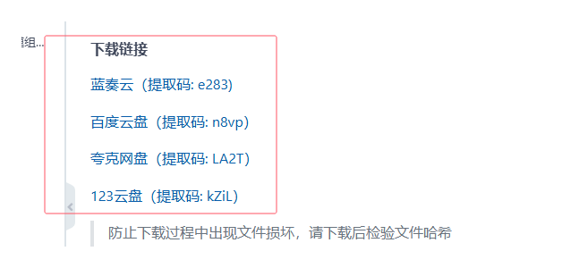

3. 将下载得到的“NieR_Automata龙版汉化（电脑版）.zip”文件解压到任意自己能找到的位置。

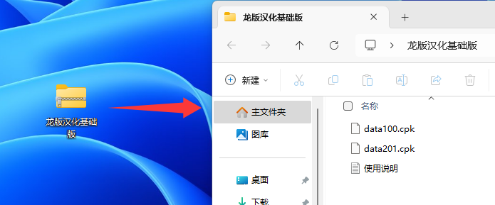

4. 在解压出来的文件中找到“LangToolsSetup.exe”，双击启动龙版汉化安装程序。  
安装程序为后台执行，并不会显示安装界面。  
只需稍等片刻，当安装完成后会自动打开汉化管理程序，并且会在桌面添加汉化管理程序的快捷方式。  
当看到汉化管理程序已经启动时，之前下载的“NieR_Automata龙版汉化（电脑版）.zip”文件和解压出来的相关文件已经用不到了，可以手动删除。

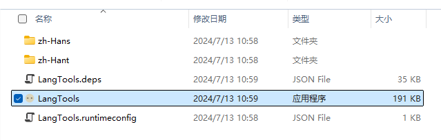

5. 选择游戏文件所在位置，默认情况下，如果你是 Steam 正版玩家，并且已经正常安装好了游戏，程序可以自动获取到游戏文件的位置。  
对于微软 Xbox 版玩家，程序并不能正常识别游戏文件的路径，因为我没有游戏本体，暂时无法添加此功能。
如果你的游戏是微软 Xbox 版，或者某些特殊情况下，程序没有获取到正确的游戏位置，那么只需要启动一次游戏，点击程序右上角的“自动定位”按钮就可以自动填写游戏路径。  
如果“自动定位”报错或者没有找到游戏路径，请通过鼠标右键菜单“以管理员身份运行”补丁安装程序。

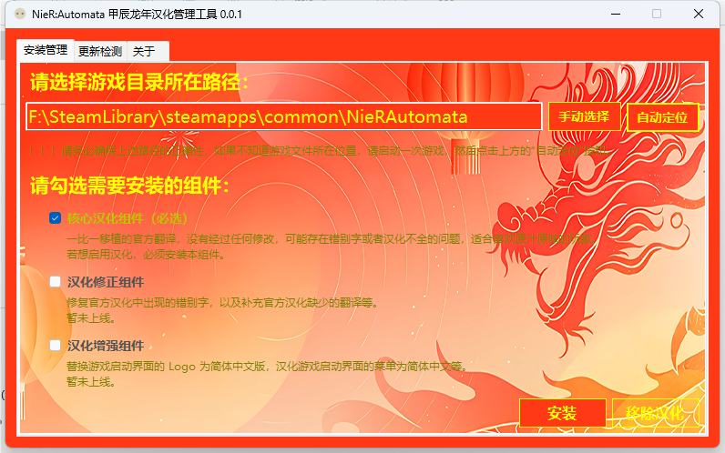

6. 确保游戏路径选择正确，在下面勾选需要安装的组件。 **务必将游戏关闭** ，然后点击“安装”按钮，等待提示完成即可。

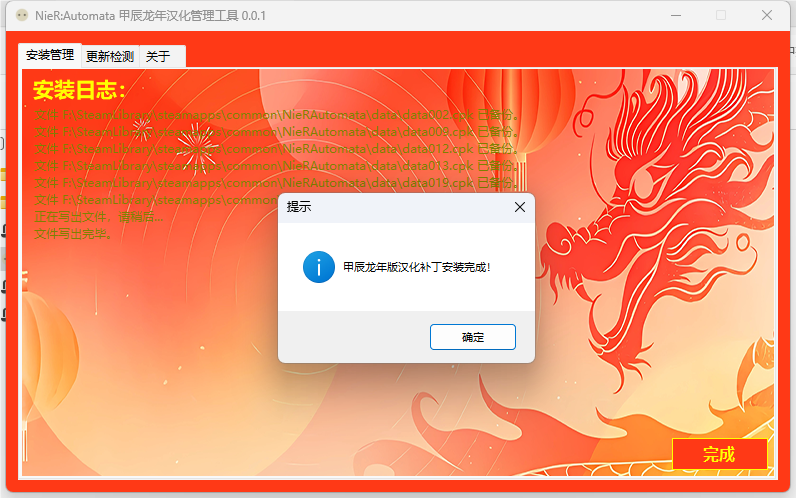

7. 关闭补丁管理程序，打开 Steam，进入库的 NieR:Automata 页面。点击右边齿轮，选择“属性。”  
在“通用”选项卡中，将语言改成“德语”后，游戏即可显示简体中文。如果需要繁体中文，请将语言改成“西班牙语”。（此步骤只影响游戏启动时的第一次 Loading 动画的显示语言，对游戏本身的显示语言并无影响）

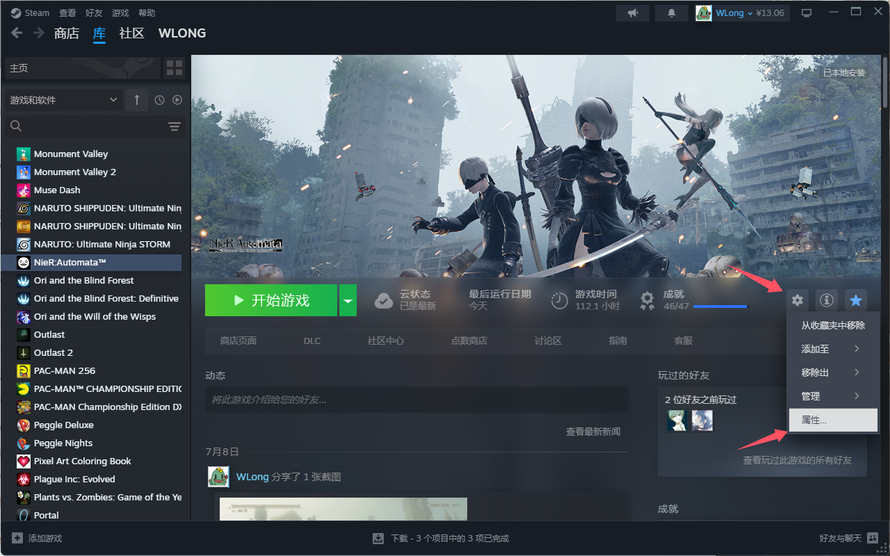
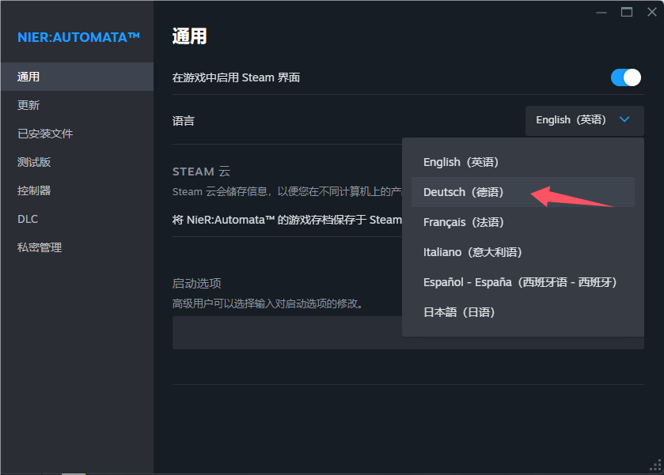

8. 正常情况下，新版本汉化补丁安装程序已经帮你把游戏语言的设置修改成简体中文了。  
如果还没有显示对应语言，只需要再在游戏内切换一下语言即可。（游戏主界面的菜单被官方写死为英文，游戏本身不支持主菜单的多语言切换，以进入游戏能看到中文为准）

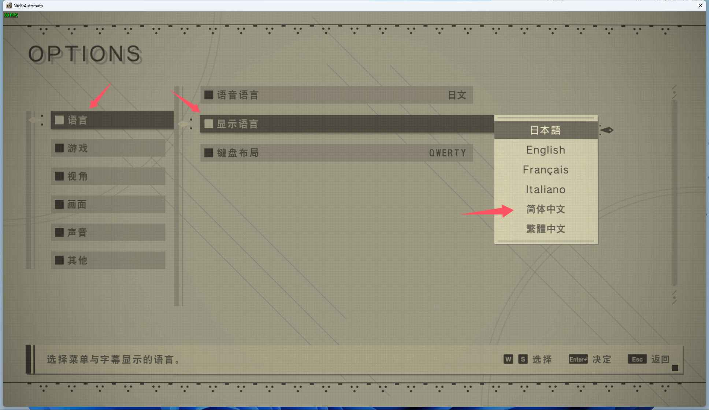

9. 恭喜，你已经可以享受中文版本的 NieR:Automata 了。

#### 移除汉化补丁

1. 在桌面或者开始菜单中找到 LangTools 程序的快捷方式，启动它。

2. 设定好游戏文件夹的路径（正常情况下，默认已经设置好）。

3. 点击程序右下角的“移除汉化”按钮，等待提示完成即可。

#### 关于补丁安装出错的处理方案

> 遇到问题应该先自行尝试解决，研究一番实在无果的时候再去考虑请教别人。  
> 如需求助，请详细描述自己遇到的问题，并提供截图、问题发生的步骤等。  

首先要保证从网盘下载的补丁文件没有发生损坏，几率很小但有可能会发生下载文件不完整的情况，最常见的就是解压压缩包的时候，系统提示无法解压或文件损坏，这种只要重新下载补丁文件来解决。

其次要保证游戏文件的完整性和正确性，更多的时候，汉化补丁没有安装成功都是因为游戏文件发生了变更（比如安装了其他汉化补丁或者模组）。需要提前将游戏文件恢复成原样，可以在 Steam 左边游戏列表里找到“NieR:Automata™”，在“NieR:Automata™”上点击右键，在弹出的菜单里点击“属性”。在属性窗口左边点击“已安装文件”菜单，在右边点击“验证游戏文件的完整性”按钮。完整性验证完成后，重新安装补丁即可。

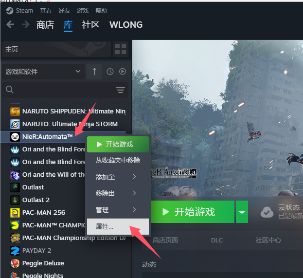
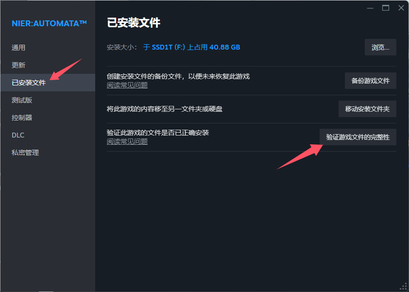

导致汉化安装不成功的另一个潜在原因是，游戏路径没有正确填写。虽然程序添加了诸多判断条件防止路径填写错误，但还是存在考虑不周的情况，所以需要再三确认游戏路径是否填写正确。

其他无法解决的问题，请加 QQ 群询问。

#### 与其他汉化补丁的比较

|				|DLC汉化	|官方翻译	|简体中文支持	|繁体中文支持	|日文支持	|英文支持	|更新状态	|
|---|---|---|---|---|---|---|---|
|天邈汉化1.4		|支持	|非官方翻译	|支持			|不支持			|不支持		|支持		|不再更新	|
|轩辕汉化6.5		|支持	|非官方翻译	|支持			|不支持			|支持		|不支持		|不再更新	|
|PS版提取1.1		|支持	|官方翻译	|不支持			|支持			|支持		|不支持		|不再更新	|
|甲辰龙年版汉化	|支持	|官方翻译	|支持			|支持			|支持		|支持		|长期更新中	|

还有其他略冷门的汉化补丁，比如游侠汉化，多合一汉化等，因为我使用较少，暂不参与比较。

#### 关于 Mod 支持

原则上只要 Mod 文件跟汉化文件没有冲突，基本不会有太大影响。但鉴于 Mod 的安装方式多种多样，实在难以保证兼容性。就目前的游戏状态来说，画质和性能已经比刚发布好太多，并不建议额外折腾 Mod。如果实在需要 Mod 请先安装汉化补丁后再安装 Mod。

#### 关于 微软商店的尼尔机械纪元成神版

由于本汉化程序现阶段基于 Steam 平台的优尔哈版制作，而微软版与 Steam 版游戏文件基本相似，所以直接安装可以使用。但相似不等于相同，至于会不会出现兼容性问题，还有待大家测试。

#### 关于此补丁尚未翻译的部分

官方并没有翻译游戏主菜单，因此目前版本追求原汁原味依然保留默认英文。  
至于游戏主界面中，顶部选项卡“MAP”、“QUEST”、“ITEM”、“WEAPON”、“SKILL”、“DATA”、“SYSTEAM”，属于官方为了游戏沉浸感，刻意保留的英文。  
以及， **游戏一周目中 BOSS 的名字并非没有翻译，而是尼尔世界中的天使文字** ，与我们现实世界的文字并不相同，因此天邈、轩辕的中文翻译属于误翻。  
除此之外，只有设置界面中关于“FidelityFX CAS”相关的两个选项没有汉化，鉴于 Switch 本身就没有这两个选项，因此当前版本暂时保留英文。  

如果，其他地方还存在没有翻译的地方，请检查汉化补丁是否安装完整，以及是否安装了其他 MOD。  
如果确认是汉化补丁存在疏漏，请指明所在位置、复现方法等，并及时向我提出反馈。

目前，在 QQ 群中，我已经制作并发布了新的字体重制补丁。新的字体补丁重做了全部文字，在 4K 分辨率的环境下不会模糊，并且完整翻译了上述所说的所有英文内容，包括主菜单、主界面、设置中的选项等。

#### 已知问题

关于游乐园 Boss 的名字与 Switch 版游戏显示不相同的问题，这其实并不是汉化导致的 BUG。因为官方为她设置了两个不同名字的词条，在不同的语言中会分别调用各自的词条。比如日文中显示的是“ボーヴォワール”，翻译成中文意思大概是“波娃”，而英文中显示的是“Simone”，翻译成中文也就是“西蒙”。虽然可以强制将文本改过来，但这会导致中文翻译与对应词条的意思不相同，这很不优雅甚至会导致新的 BUG，所以这个版本暂时不打算做任何修改。

#### 问题反馈和游戏模组交流

QQ群：162212815

#### 支持开发者

本工具是完全免费的，现在和以后都不会加入任何广告和恶意代码。作者平时上班比较忙，为了开发了这个工具付出了很多宝贵的业余时间。如果你有心想支持鼓励作者继续开发维护的话，可以请作者喝杯咖啡，或者与作者分享你喜欢的零食。 :yum: 

>  :loudspeaker:  :loudspeaker:  :loudspeaker:   
> **请务必备注您来自“尼尔汉化”之类的关键词**，不然我难以区分您的捐助来自哪个项目。  
> 如果发现没有您的名字，或者名字有误，联系我后，可以通过提供订单号来修改。  
> **请妥善保存您的订单号，后期可能会为已捐助用户提供专属功能（专属名称、外观等）。**

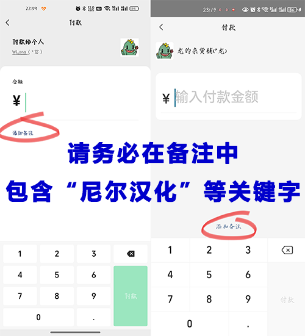

#### 捐赠者名单

> 捐赠金额就不公布了，或多或少都是心意，我由衷的表示感谢，感谢大家对我所作工作的肯定。

|捐赠日期|渠道|捐赠者昵称|备注|
|---|---|---|---|
|2024/12/20|支付宝|**畅| |
|2024/12/17|微信|*亮| |
|2024/12/17|支付宝|**屹|来自尼尔|
|2024/12/17|微信|*锡|来自尼尔，感谢大佬|
|2024/12/07|支付宝|*锐|尼尔汉化补丁，感谢大佬|
|2024/12/07|微信|*号|来自尼尔|
|2024/12/06|微信|*🐒|来自尼尔，感谢感谢|
|2024/12/04|微信|*航|谢谢你的尼尔汉化|
|2024/12/03|微信|=*=|尼尔汉化|
|2024/12/03|微信|*子|感谢大佬汉化|
|2024/12/01|支付宝|**鑫|小小心意，感谢大佬的尼尔汉化，忘记备注了抱歉[傻笑][傻笑]|
|2024/12/01|支付宝|**锋|来自尼尔，谢谢汉化|
|2024/11/30|微信|*逑|来自尼尔，买杯脉动吧！随时脉动回来，辛苦！|
|2024/11/29|微信|T*e|来自尼尔，感谢作者的努力，以后也继续加油 暂时赞助这些|
|2024/11/29|支付宝|**村|来自尼尔|
|2024/11/28|微信|*茶|谢谢|
|2024/11/28|支付宝|**鑫| |
|2024/11/23|微信|*山|谢谢！爱来自尼尔|
|2024/11/23|微信|M*g|非常好的汉化，爱来自尼尔，作者干巴爹|
|2024/11/22|微信|*栋|来自尼尔|
|2024/11/21|微信|Y*k| |
|2024/11/20|微信|*功|来自尼尔，感谢汉化|
|2024/11/19|微信|*。|来自尼尔|
|2024/11/18|微信|*🥃|来自尼尔|
|2024/11/15|支付宝|**康|一点点心意。感谢大佬汉化尼尔|
|2024/11/14|支付宝|**石|尼尔！|
|2024/11/13|支付宝|**智|尼尔机械纪元|
|2024/11/12|微信|*海|来自尼尔|
|2024/11/07|微信|*鹤|来自尼尔，感谢你们的辛苦与付出|
|2024/10/26|QQ|比翼|尼尔汉化|
|2024/10/22|QQ|往古来今|感谢大佬的尼尔汉化|
|2024/10/21|微信|*#|尼尔汉化，请up喝杯伯牙绝弦|
|2024/10/21|微信|_*C|汉化辛苦|
|2024/10/21|微信|*📉|尼尔|
|2024/10/18|支付宝|*琛|尼尔汉化 支持|
|2024/10/17|微信|*学| |
|2024/10/16|微信|*势|来自尼尔|
|2024/10/05|微信|*🌸|来自尼尔|
|2024/10/05|微信|*³|尼尔汉化|
|2024/10/04|支付宝|**杰| |
|2024/09/28|QQ|很高兴认识，...|感谢尼尔汉化|
|2024/09/27|QQ|雨色|尼尔汉化 让我撅撅你|
|2024/09/27|微信|*画|尼尔汉化辛苦了，学生没钱🙈|
|2024/09/26|支付宝|**曦| |
|2024/09/23|微信|*点|来自尼尔（穷穷大学牲的支持）|
|2024/09/20|微信|*龙|感谢对尼尔机械纪元汉化|
|2024/09/19|微信|*1|尼尔汉化|
|2024/09/18|微信|*哲|来自尼尔，一点心意|
|2024/09/14|微信|*宵|来自NieR|
|2024/09/01|微信|*安| |
|2024/08/21|微信|A*l| |
|2024/08/16|微信|*l| |
|2024/08/10|微信|*🐟| |
|2024/08/06|支付宝|*洋|尼尔汉化 一点绵薄之力支持一下|
|2024/08/04|微信|*宇|尼尔汉化（QQ：万法齐观）|
|2024/08/01|微信|J*g|尼尔汉化|
|2024/07/22|微信|*乔|来自尼尔汉化˙ᵕ˙ᰔᩚ|
|2024/07/20|支付宝|**郁|来自尼尔 加油大佬|
|2024/07/17|微信|*曜|尼尔汉化赞助（尼尔是我最喜欢的游戏之一，老哥加油）（最近没啥钱，只能请杯奶茶了，抱歉呐）|
|2024/07/13|QQ|翩翩天使|非常好汉化，使我2b旋转|
